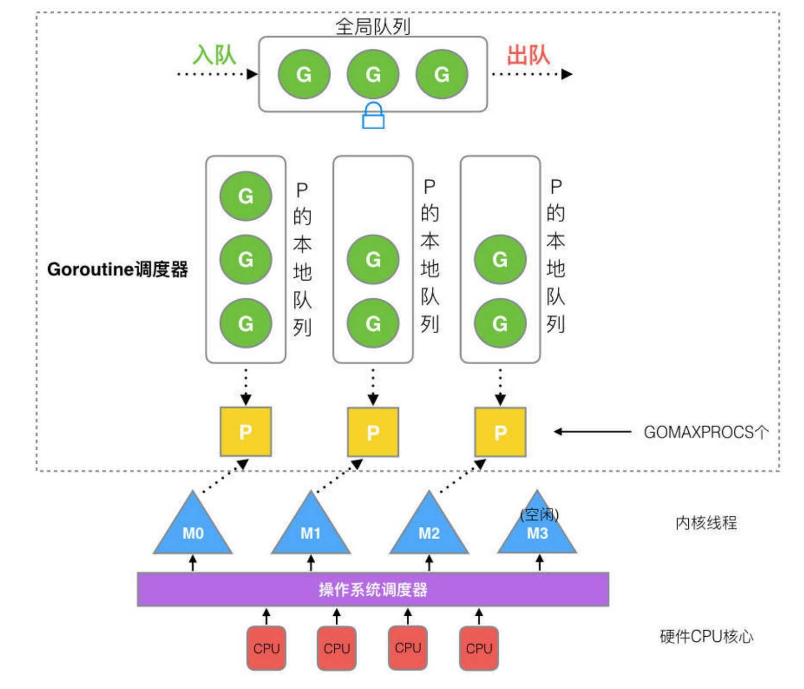

# go-learn


#### *四月*

|             Mon.             | Tues. | Wed. | Thur. |             Fri.             |             Sat.             |             Sun.             |
| :--------------------------: | :---: | :--: | :---: | :--------------------------: | :--------------------------: | :--------------------------: |
|              1               |   2   |  3   |   4   |              5               |              6               |              7               |
|              8               |   9   |  10  |  11   |              12              |              13              |              14              |
|              15              |  16   |  17  |  18   |              19              |              20              |              21              |
|              22              |  23   |  24  |  25   | 26<br>([D1](#2024426-Day1 )) | 27<br>([D2](#2024427-Day2 )) | 28<br>([D3](#2024428-Day3 )) |
| 29<br>([D4](#2024429-Day4 )) |  30   |      |       |                              |                              |                              |


#### *五月*

| Mon. | Tues. |             Wed.             | Thur. |             Fri.             | Sat. | Sun. |
| :--: | :---: | :--------------------------: | :---: | :--------------------------: | :--: | :--: |
|      |       | 1<br/>([D5](#2024501-Day6 )) |   2   | 3<br/>([D6](#2024503-Day7 )) |  4   |  5   |
|  6   |   7   | 8<br/>([D7](#2024508-Day7 )) |   9   |              10              |  11  |  12  |
|  13  |  14   |              15              |  16   |              17              |  18  |  19  |
|  20  |  21   |              22              |  23   |              24              |  25  |  26  |
|  27  |  28   |              29              |  30   |              31              |      |      |

##  2024/4/26 Day1 

今天学习时长1h

主要学习内容：

- 函数的基本使用
- 函数的动态参数
- 函数可以作为参数以及返回值
- defer、panic以及recover的使用

## 2024/4/27 Day2 

leetcode 刷题

- [盛最多水的容器](https://leetcode.cn/problems/container-with-most-water/description/?envType=study-plan-v2&amp;envId=top-interview-150) 
- [三数之和](https://leetcode.cn/problems/3sum/description/?envType=study-plan-v2&amp;envId=top-interview-150)

今天学习内容：

- go语言的结构体

## 2024/4/28 Day3

leetcode 刷题

- [长度最小的子数组](https://leetcode.cn/problems/minimum-size-subarray-sum/)

go语言的指针用法

## 2024/4/29 Day4

LeetCode刷题

[无重复字符的最长子串](https://leetcode.cn/problems/longest-substring-without-repeating-characters/)

## 2024/4/30 Day5

今天摆烂...没有学..

## 2024/5/01 Day6

突然发现....昨天写的没了...草！！！

[串联所有单词的子串](https://leetcode.cn/problems/substring-with-concatenation-of-all-words/)

go语言中没有用来比较两个hashmap是否相等，今天写了一个比较hashmap的函数

```go
func mapsEqual(a, b map[string]int) bool {
	if len(a) != len(b) {
		return false
	}
	for k, v := range a {
		if _, ok := b[k]; !ok || v != b[k] {
			return false
		}
	}
	return true
}
```


go modules

```
go get "框架地址" 用于下载包，go get会修改go.mod文件

go mod用法

download    download modules to local cache
edit        edit go.mod from tools or scripts
graph       print module requirement graph
init        initialize new module in current directory
tidy        add missing and remove unused modules
vendor      make vendored copy of dependencies
verify      verify dependencies have expected content
why         explain why packages or modules are needed

go get -u 用来升级最新版本
```

### 代码规范

#### 1、代码规范

##### 1.1 命名规范

- 包名

  1、尽量和目录保持一致

  2、尽量采取有意义的包名

  3、不要和标注库名冲突

  4、包名采用全部小写

- 文件名

  user_name.go 小写加下划线

- 变量名

  尽量驼峰命名

- 结构体命名

  User

- 接口命名，和结构体命名差不多

- 常量命名，全部大写，如果有多个单词，使用下划线QUESTION_ANSWER

#### 2、注释规范

// 单行注释

/**

多行注释

/

#### 3、import规范

1、go自带的包

2、第三方的包

3、内部的包

#### 单元测试

go test 命令是一个按照一定约定和组织的测试代码驱动程序，在包目录中，所有以_test.go为后缀的源码文件都会被go test运行到

go build命令不会将这些测试文件打包到最后的可执行文件中，**测试用例与被测试的文件必须在同目录下**

```go
// /ch07/coding/add_test.go
func TestAdd(t *testing.T) {
	res := add(1, 2)

	if res != 4 {
		t.Errorf("错误")
	}
}

// /ch07/coding/add.go
func add(a, b int) int {
	return a + b
}

```


## 2024/5/03 Day7

leetcode：

[有效的数独](https://leetcode.cn/problems/valid-sudoku/)


goroutine go语言中的协程，底层采用GMP模型来与内核线程进行绑定，G为goroutine，M为内核级线程，p为处理器，主要是对G于M的绑定以及存储相应的G。



```go
// WaitGroup 主要用于goroutine的执行等待，Add方法要和Done结合

func go_routine_wait() {
	var ws sync.WaitGroup
	// 需要监控多少个goroutine结束
	ws.Add(100)
	for i := 0; i < 100; i++ {
		go func(i int) {

			// defer ws.Done() 也可以使用defer来
			fmt.Println(i)
			// 结束
			ws.Done()
		}(i)
	}

	ws.Wait()
}
```


#### go lock

go语言的锁主要有两种，分别是互斥锁以及读写锁

1、互斥锁

```go
var lc sync.Mutex

func add() {
	lc.Lock()
	for i := 0; i < 100000; i++ {
		total += 1
	}
	lc.Unlock() // 记得释放锁
	wg.Done()
}
```

2、读写锁

```go
// 锁的本质是将并行的代码串行化了，使用lock肯定会影响性能
// 即使是设计锁，那么也应该尽量保证并行
// 现在有两组协程，一组负责写数据，一组负责度数据

func main() {
	var rwlock sync.RWMutex
	var total int
	var wg sync.WaitGroup

	wg.Add(2)
	// 写goroutine
	go func() {
		defer wg.Done()
		// 加写锁，写锁会防止别的写锁以及读锁
		rwlock.Lock()
		defer rwlock.Unlock()

		total = 12
	}()

	go func() {
		defer wg.Done()
		// 加读锁，读锁不会阻止别的读锁
		rwlock.RLock()
		defer rwlock.RUnlock()
		fmt.Println(total)
	}()

	wg.Wait()
}

```

## 2024/5/08 Day8

LeetCode题目：

- [单词规律](https://leetcode.cn/problems/word-pattern/)
- [有效的字母异位词](https://leetcode.cn/problems/valid-anagram/)

## 2024/5/09 Day9

LeetCode题目：

- [字母异位词分组](https://leetcode.cn/problems/group-anagrams/)

字符串排序：

```go
t := []byte(str) // 先将字符串转化为数组
sort.Slice(t, func(i, j int) bool { return t[i] < t[j] }) 在进行排序
```

